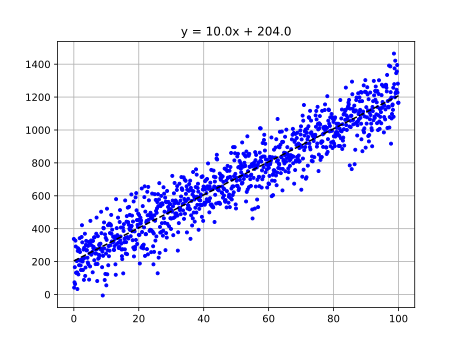

# Lineární regrese s numpy a matplotlib

Zkuste naprogramovat program, který vygeneruje obrázek podobný tomuto:

Vyjděte ze souboru [regression.py](regression.py), jedna možnost řešení je [regression_solved.py](regression_solved.py).
